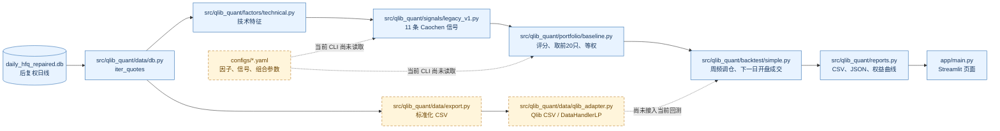

# qlib_quant 框架结构图

这张图描述当前项目已经存在的真实运行链路。实线表示当前代码直接调用；虚线表示已经准备好、但当前 `backtest` 命令还没有接入的接口。

## 模块职责

| 模块 | 当前职责 | 当前状态 |
| --- | --- | --- |
| `data/db.py` | 从 repaired SQLite 读取股票日线 | 已运行 |
| `factors/technical.py` | 计算移动平均、收益率、区间高低点、量比和额比 | 已运行 |
| `signals/legacy_v1.py` | 将11条规则转成布尔列和 `signal_score` | 已运行 |
| `portfolio/baseline.py` | 按分数排序，最多20只，等权 | 已运行 |
| `backtest/simple.py` | 周频目标组合、下一交易日开盘成交、费用扣除 | 已运行，但需先修正记账问题 |
| `reports.py` | 输出权益、交易、摘要和 PNG | 已运行 |
| `data/qlib_adapter.py` | 输出 Qlib 风格 CSV，提供 `DataHandlerLP` 适配入口 | 接口已备，尚未成为回测主引擎 |
| `configs/*.yaml` | 保存可调参数和信号名单 | 文件已备，当前 CLI 尚未加载 |
| `app/main.py` | 查看回测摘要和权益曲线 | 已运行 |

