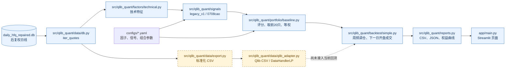

# qlib_quant 框架结构图

这张图描述当前项目已经存在的真实运行链路。实线表示当前代码直接调用；虚线表示已经准备好、但当前 `backtest` 命令还没有接入的接口。

```mermaid
flowchart LR
    DB[(daily_hfq_repaired.db<br/>后复权日线)] --> READ[src/qlib_quant/data/db.py<br/>iter_quotes]
    READ --> FACT[src/qlib_quant/factors/technical.py<br/>技术特征]
    FACT --> SIG[src/qlib_quant/signals<br/>legacy_v1 / 0708cao]
    SIG --> PORT[src/qlib_quant/portfolio/baseline.py<br/>评分、取前20只、等权]
    PORT --> BT[src/qlib_quant/backtest/simple.py<br/>周频调仓、下一日开盘成交]
    BT --> REPORT[src/qlib_quant/reports.py<br/>CSV、JSON、权益曲线]
    REPORT --> UI[app/main.py<br/>Streamlit 页面]

    READ --> EXPORT[src/qlib_quant/data/export.py<br/>标准化 CSV]
    EXPORT --> QLIB[src/qlib_quant/data/qlib_adapter.py<br/>Qlib CSV / DataHandlerLP]
    QLIB -.尚未接入当前回测.-> BT

    CONFIG[configs/*.yaml<br/>因子、信号、组合参数] --> SIG
    CONFIG --> PORT

    classDef active fill:#e8f3ff,stroke:#2b6cb0,color:#17365d;
    classDef data fill:#eef8ee,stroke:#3c8c40,color:#1f4d22;
    classDef pending fill:#fff5db,stroke:#b7791f,color:#6b4300,stroke-dasharray: 6 4;
    class DB,READ,FACT,SIG,PORT,BT,REPORT,UI active;
    class EXPORT,QLIB pending;
```

## 模块职责

| 模块 | 当前职责 | 当前状态 |
| --- | --- | --- |
| `data/db.py` | 从 repaired SQLite 读取股票日线 | 已运行 |
| `factors/technical.py` | 计算移动平均、收益率、区间高低点、量比和额比 | 已运行 |
| `signals/legacy_v1.py` | 保留旧版规则，生成布尔信号和评分 | 已运行 |
| `signals/zff0708.py` | 按ZFF0708 F列生成独立新信号及子条件诊断 | 已接入工作台 |
| `portfolio/baseline.py` | 按分数排序，最多20只，等权 | 已运行 |
| `backtest/simple.py` | 周频目标组合、下一交易日开盘差额成交、费用扣除及陈旧估值 | 已通过 V1 小样本账本验收 |
| `reports.py` | 输出权益、交易、摘要和 PNG | 已运行 |
| `data/qlib_adapter.py` | 输出 Qlib 风格 CSV，提供 `DataHandlerLP` 适配入口 | 接口已备，尚未成为回测主引擎 |
| `configs/*.yaml` | 保存可调参数和信号名单 | 运行服务已加载，未实现阈值会提示 |
| `runner.py` / `jobs.py` | 参数快照、后台执行、任务互斥、取消和状态恢复 | 已通过 V1 验收 |
| `app/main.py` | 首页、回测表单、实验对比、报告下载和编辑导航 | 已通过本地操作验收 |
